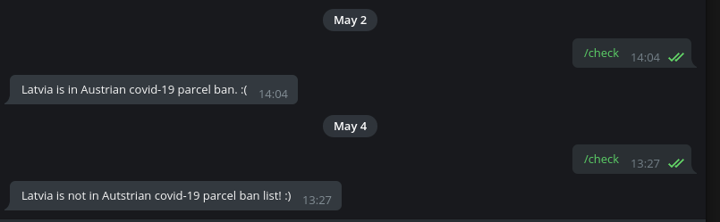

# Pacel Bot
I never thought that Covid-19 pandemic would affect one of my hobbies, which is collecting records.  
I recently bought a record and the seller is located in Austria. Austrian postal service has suspended parcel shipments to Latvia (country I live in).  
I'm inpatient and cannot be bothered to check webiste of Austrian Post everyday, so I made a Telegram bot, that is able to check if Latvia is still in the "ban list".

## Ideas and wanna-dos for this project
* I wanted to give TypeScript a try
* Project must use Docker, so that I can deploy this bot either to my vps or my raspberry pi

## Some thoughts
Some of the choices I've made don't follow "best practices", but I didn't want to invest more time than needed - for example - adjusting axios request headers to be able to return webpage html. I used curl for that, because that was the quickest solution. Hopefuly, I'll get a kick out of this repo after some time has passed.

## How to run this?
You'll need your own Telegram bot token! 
Create a copy of settings.env.example and name it settings.env, write your bot code there. Then, build a docker image:
```
docker build -t parcelbot .
```
Run docker container:
```
docker run -d parcelbot
```

# 04.05.2020

Parcel bot served me well and it was a fun project. Now all I have to do is to wait for the shipiment to arrive! :)